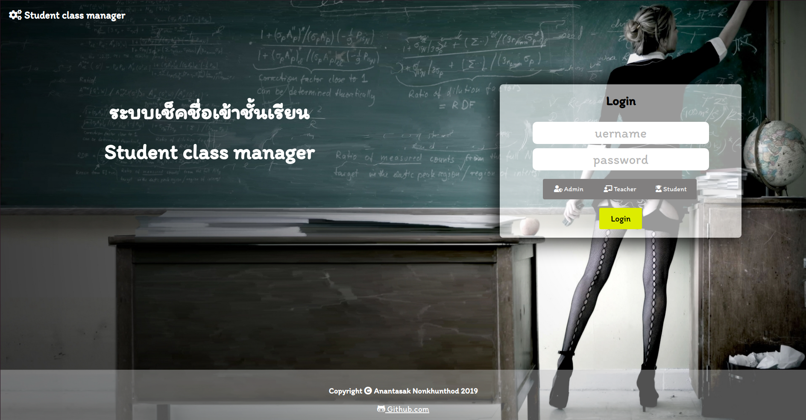
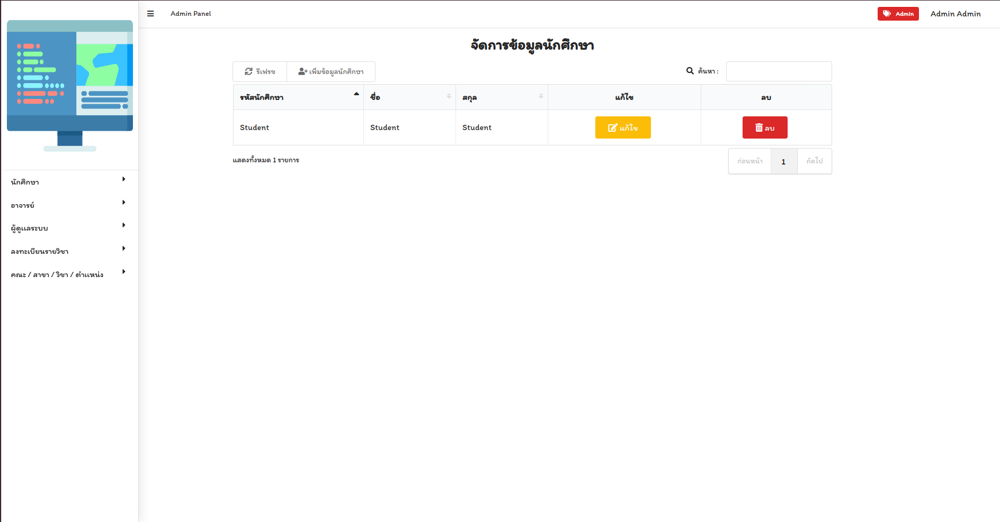
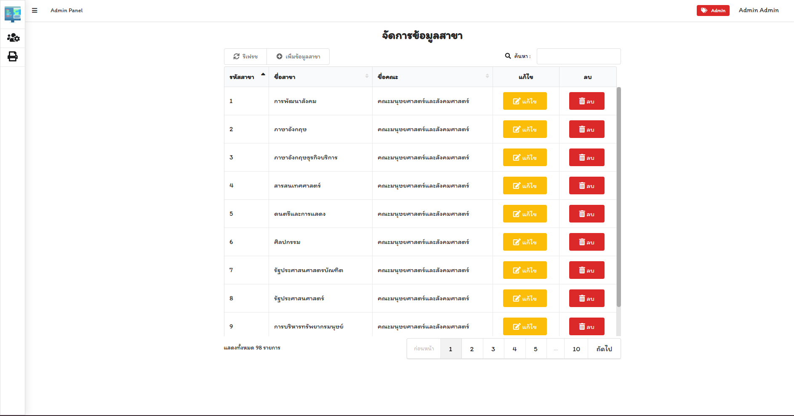
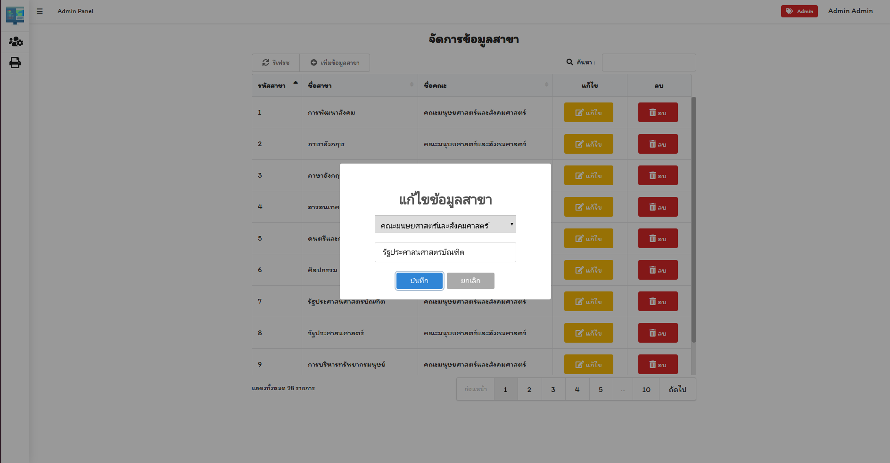
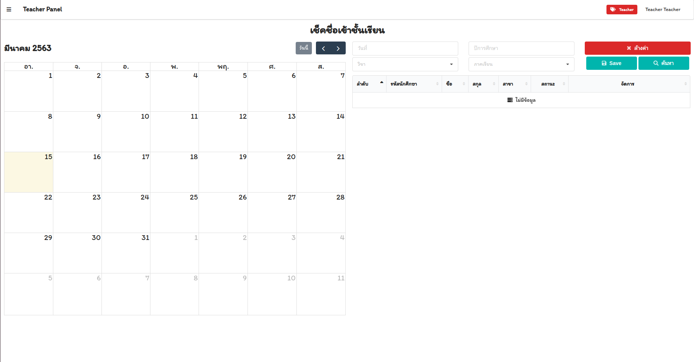

<p align="center">
</p>


## Student Class Manager 
- Base On Laravel 6
- Dynamic web application
- UI Base on
    - [Fomantic UI](https://fomantic-ui.com)
    - [Alertify Js](https://alertifyjs.com) 
    - [Sweet Alert 2](https://sweetalert2.github.io)
    - [Data Table](https://datatables.net)
    - [Year Picker](https://github.com/saravanajd/YearPicker)
    - [Full Calendar](https://fullcalendar.io)
## Screen shot
<p align="center">





</p>

## How to use
```
> npm run dev
```
```
> composer update
```
```
> php artisan db:seed
```
```
> php artisan run serve
```
## Default User
### **Note** : Please run seed first.
```
php artisan db:seed
```
| USER | PASSWORD | 
| :-- | :-- |
| Admin | Password |
| Teacher | Password |
| Student | Password |
```

```
## License

[MIT license](https://opensource.org/licenses/MIT)


